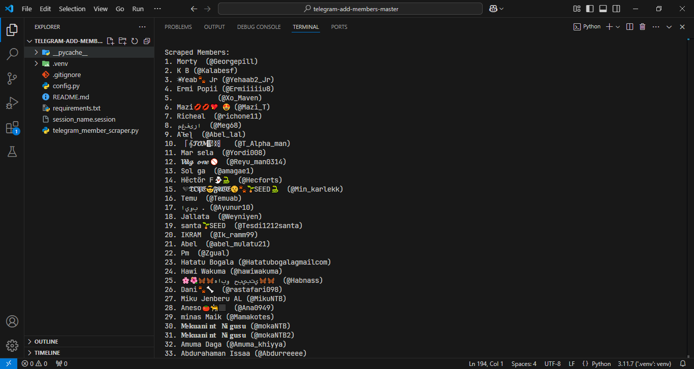
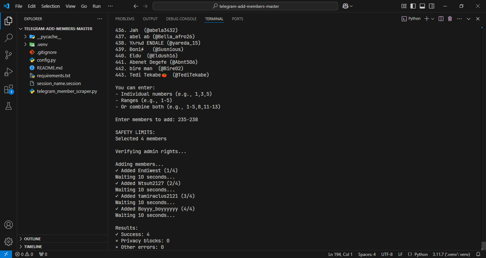

# Telegram Member Scraper and Adder

## Description
This project allows you to easily scrape members from a source Telegram group and add them to a target group where you have administrative rights. The script features a user-friendly interface with range-based member selection and built-in safety measures to prevent triggering Telegram's anti-spam restrictions.

## Screenshots
Here's how the program looks in action:


*List of Scrapped Members*


*Member selection and adding process*

## Features
- Scrape members from any source Telegram group
- Smart member selection with support for:
  - Individual selection (e.g., "1,3,5")
  - Range selection (e.g., "1-10")
  - Combined selection (e.g., "1-5,8,11-13")
- Built-in safety checks and delays to prevent triggering Telegram's restrictions
- Secure password input with asterisk masking
- Clear and intuitive prompts for all user inputs

## Prerequisites
- Python 3.7+
- Telethon library
- A Telegram account
- Admin rights in the target group
- Telegram API credentials (API ID and API Hash)

## Setup
1. Install Python requirements:
   ```bash
   pip install -r requirements.txt
   ```

2. Configure your credentials:
   - Open `config.py` in a text editor
   - Get your API credentials from https://my.telegram.org/apps
   - Fill in your:
     - API_ID (numbers only)
     - API_HASH (string of letters and numbers)
     - PHONE (your phone number with country code, e.g., '+1234567890')

## Usage
1. Run the script:
   ```bash
   python telegram_member_scraper.py
   ```

2. Follow the prompts:
   - Enter your verification code received in Telegram
   - Enter source group username (the group to scrape members from)
   - Enter target group username (the group to add members to)

3. Select members to add using any of these formats:
   - Individual numbers: "1,3,5"
   - Ranges: "1-10"
   - Combined: "1-5,8,11-13"

4. Monitor the progress as members are added

## Safety Features
- Automatic delay between adding members (10 seconds)
- Warning for large member selections (>35 members)
- Automatic handling of Telegram's flood wait restrictions
- Privacy restriction detection for individual users

## Important Notes
- Keep your `config.py` and session files secure
- Recommended limits:
  - Maximum 50 members per day
  - Maximum 35 members per hour
- The script automatically handles waiting periods if Telegram enforces them

## Troubleshooting
If you encounter any of these issues:
- **FloodWaitError**: The script will automatically wait for the required time
- **UserPrivacyRestrictedError**: The user has restricted who can add them to groups
- **PeerFloodError**: You've hit Telegram's rate limit, the script will pause

## Disclaimer
Use this script responsibly and in accordance with Telegram's terms of service. The author is not responsible for any misuse or violations of Telegram's policies.
